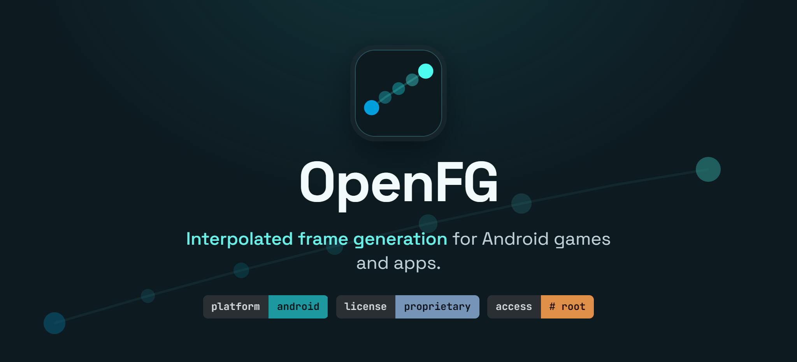

## ⬇️ 下载 · Download

> **⚠️ 必须同时下载模块！只安装 App 无法生效。**
> **The module is REQUIRED — the app alone does nothing.**

| 文件 | 说明 |
|---|---|
| [`openfg-v1.2-release.zip`](releases/download/v1.2-zh/openfg-v1.2-release.zip) | **必需 · 模块** — 用 KernelSU / Magisk 刷入后重启。官方 v1.2 原版模块，未做任何改动 |
| [`OpenFG_v1.2_zh-CN.apk`](releases/download/v1.2-zh/OpenFG_v1.2_zh-CN.apk) | **简体中文版 App** — v1.2 (105) 界面汉化，直接安装 |
| `openfg-app-v1.2.apk` | 官方原版 App（英文，可选对照） — [上游 Releases](https://github.com/OpenFGG/openfg-app/releases) |

全部文件见 **[Releases → v1.2-zh](releases/tag/v1.2-zh)**；汉化补丁与中英对照表见 [`zh-CN/`](zh-CN)。

### 安装顺序（照此操作，否则补帧不会生效）

1. **刷模块** — 在 KernelSU / Magisk 中进入 **模块 → 从存储安装** → 选择 `openfg-v1.2-release.zip` → **重启手机**
2. **装 App** — 安装 `OpenFG_v1.2_zh-CN.apk`。（若已安装原版 App，请先卸载——两者签名不同，无法覆盖安装）
3. **选游戏** — 打开 **OpenFG**，在列表中打开你想要补帧的游戏
4. **进游戏** — 启动该游戏，屏幕上出现小的 FPS 计数器（真实 / 生成）即表示补帧已生效

> 前提：已 root（KernelSU 或 Magisk）并启用 **Zygisk**。**缺少模块时，App 能装但补帧不会工作**，界面上会直接提示“模块未安装”。

## Compatibility

| Requirement | |
|---|---|
| **Android** | 10 or newer (11+ recommended) |
| **Root** | KernelSU **or** Magisk, with **Zygisk** enabled |
| **CPU / ABI** | arm64 (64-bit) or arm32 (32-bit) |
| **Graphics** | OpenGL ES 3.0+ or Vulkan games |

**Tested on:** Qualcomm Snapdragon / Adreno and Arm Mali. Other GPUs (Xclipse, PowerVR) are expected to
work but aren't verified yet. **Emulators:** supported — BannerHub, GameNative, Winlator, PPSSPP, Eden
and Citra tested.

## Install

1. **Flash the module** — in the KernelSU or Magisk app → **Modules → Install from storage** → select
   `openfg-<version>-release.zip` → **reboot**.
2. **Install the app** — install `openfg-app-<version>.apk`.
3. **Pick your games** — open the **OpenFG** app and toggle on the games you want enhanced.
4. **Play** — Launch a selected game. A small on-screen counter (real / generated FPS) confirms frame
   generation is active.

To disable it for a game, toggle it off in the app and restart that game.

## Download

Grab the **module zip** and the **APK** from the [Releases](releases) page.
**Both are needed:** flash the module, reboot, then install the app.

## Notes

- **Use at your own risk.** OpenFG changes how games present frames. **Online games with anti-cheat may
  flag modified clients** — don't use it there.
- **Closed source for now.** Binaries only; no source is distributed. Provided as-is, without warranty.

---

*OpenFG — Open Frame Generation.*
